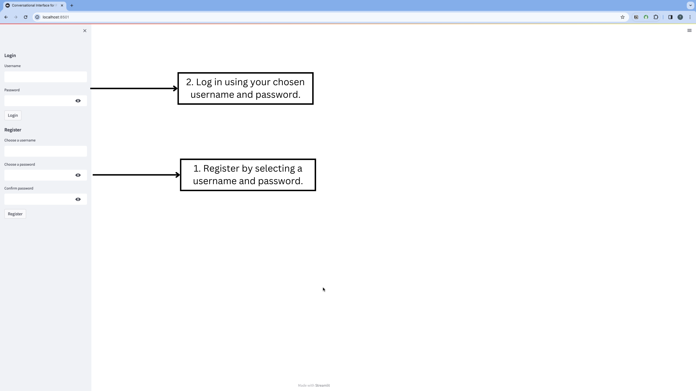
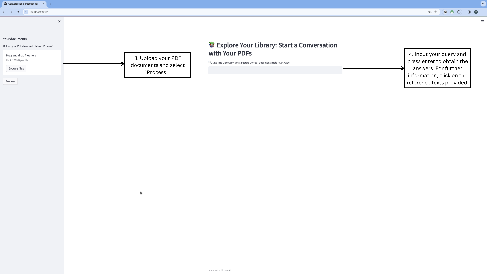

# Chat with Mutilple PDF Files Application

## Overview

This project introduces a conversational interface designed to interact with content extracted from multiple PDF files. By leveraging a chatbot framework, users can upload several PDF documents and ask questions, receiving answers based on the contents of those documents. Additionally, the system includes a demonstration of user verification through a SQL database, showcasing a complete user management system.

The application is capable of providing reference texts from the uploaded documents to substantiate its responses, enhancing the user experience by offering direct insights from the source material.

Deployed on Streamlit, this project exemplifies a practical application of natural language processing and document handling within a web application.

## Technologies
### RAG's Architecture Components

1. **Retrieval Component:** Responsible for fetching relevant information from a database or document collection based on the user's query.
2. **Generation Component:** Utilizes the retrieved information to generate coherent and contextually appropriate responses.
   
### Roles of LangChain and OpenAI API

1. **LangChain (Within the Retrieval Component):** LangChain's RetrievalQA is integral to the retrieval component. It indexes and understands the content of multiple PDFs, enabling the system to perform semantic searches across the documents. This capability ensures that the most relevant passages are identified and retrieved in response to user queries, setting the foundation for accurate and informed response generation.

2. **OpenAI API (Within the Generation Component):** The OpenAI API, leveraging models like GPT-3.5, functions within the generation component. It takes the context and information retrieved by LangChain to construct detailed, natural language responses. The API's advanced language models are adept at synthesizing information, ensuring that the generated text is not only relevant but also engaging and nuanced, reflecting a deep understanding of the query and the retrieved data.

### Integration in RAG's Architecture

1. **Retrieval-QA for Precision:**  RetrievalQA excels in fetching specific reference texts from documents in response to user queries. This ensures that answers are not only relevant but also directly linked to the source material, enhancing the trustworthiness and depth of responses.

2. **Generative Models for Coherence:** With the relevant information retrieved, OpenAI's generative models craft responses that are coherent, contextually enriched, and reflective of the input query and the retrieved document content. This process exemplifies how generative AI can transform raw data into meaningful dialogue.

[Koninck, 2023](https://blog.ml6.eu/leveraging-llms-on-your-domain-specific-knowledge-base-4441c8837b47)

### Streamlit for User-Friendly Interface and Real-time Interaction

Streamlit is the preferred choice for deploying this chat application due to its streamlined deployment process and exceptional support for data science and machine learning projects. Its ability to rapidly create user-friendly interfaces with minimal coding makes it particularly suited for applications that require interactive data handling and real-time user engagement. This makes Streamlit an ideal framework for developing and launching applications that blend sophisticated backend logic with an intuitive frontend, ensuring a seamless and engaging user experience.

## OpenAI API Key Management and Usage

### Understanding OpenAI API Costs

The OpenAI API provides new users with a $18 credit, allowing for initial use without incurring costs. Once this credit is depleted, users will be switched to a pay-as-you-go model. It is crucial for users to monitor their usage to manage expenses effectively. Detailed pricing can be found on the OpenAI pricing page.

### Obtaining Your OpenAI API Key

To use the OpenAI API, an API key is required:

1. Visit [OpenAI API Keys](https://platform.openai.com/api-keys) to obtain or create your API key.
2. If you do not have an account, sign up and navigate to the API keys section.
3. Create a new API key if you haven't already.

### Important Considerations for Hosting

1. **Security Warning:** The OpenAI API key is unable to be hosted in public repositories (e.g., GitHub) as it can lead to unauthorized use and financial charges. OpenAI automatically disables exposed keys to prevent misuse.
2. **Local Deployment:** It's recommended to run the application locally to keep your API key secure.

## Features

1. **Interactive Chat Interface:** Ask questions and receive answers that reference the contents of uploaded PDF files.
2. **Multi-Document Support:** Upload and process multiple PDF files simultaneously for comprehensive query support.
3. **Secure User Verification:** Demonstrates user authentication and management through a SQL database.
4. **Contextual Answers with References:** Provides reference excerpts directly from the uploaded documents to back up the chatbot's responses.

## Getting Started

### Prerequisites
- pip

### Installation

1. Clone the repository:
git clone https://github.com/TrangDo2104/final-chat-with-pdf.git

2. Navigate to the project directory and install the required dependencies:
cd final-chat-with-pdf
pip install -r requirements.txt

3. Set up your OpenAI API key in a `.env` file within the project directory:
OPENAI_API_KEY=your_api_key_here (OPENAI_API_KEY=sk-.....)

### Running the Application

Launch the application by running:
streamlit run app.py

## Usage
**To ensure optimal functionality, please follow these steps:**
1. **Sign Up/Login:** Start by signing up for an account or logging in.
   

2. **Upload Documents:** Click on "Upload your PDFs" to select and process your documents.

3. **Query:** Use the chat interface to ask questions and receive information based on the content of your uploaded documents.

## Planned Improvements

1. **Reference Text Filtering:** 
- ***Current Limitation***: Our application ensures relevance by focusing directly on user queries, avoiding responses to unrelated questions such as "How can I help you?" or misunderstandings like "I don't get information from the uploaded documents." However, it's important to note that reference texts from uploaded documents are still provided below the main answer.
- ***Proposed Enhancement***: Implement a filtering mechanism to restrict the provision of reference texts strictly to those directly relevant to the user's query. Currently, I used a UI element like a dropdown (expander) to allow users to choose when to view these references, thereby not cluttering the interface with potentially irrelevant information.
2. **Advanced Information Retrieval:** 
- ***Current Limitation***:The system is capable of retrieving reference text information from the uploaded documents but does not offer show specific source files or page numbers. This limits the user's ability to locate the exact source of the information within the documents.
- ***Proposed Enhancement***: Expand the retrieval capabilities to include options for users to select specific embeddings for extracting information. Utilize the retriever.get_relevant_documents(query) function to pinpoint and retrieve detailed document metadata, such as the source file and page number. Consider the implementation challenges within Streamlit and explore ways to integrate these advanced features into the user interface.
3. **User Interaction Enhancements:** 
- ***Current Limitation***: The application requires users to follow a sequence of actions: uploading and processing files before initiating any queries. This workflow can confuse new users or those who may inadvertently attempt to query before completing the necessary preliminary steps.
- ***Proposed Enhancement***: Develop a more intuitive and flexible user interaction flow that allows for non-linear actions. For example, enable the chat interface immediately upon login and guide users through the document upload and processing steps as needed.
4. **Secure API Key Management:** 
- ***Current Limitation***: Deploying the application on public platforms like GitHub or Streamlit sharing poses a challenge, especially concerning the secure management of the OpenAI API key. Exposing sensitive keys in public repositories or applications can lead to security risks and unauthorized usage.
- ***Proposed Enhancement***:Explore and implement secure methods for API key management in public deployments. Consider utilizing environment variables on deployment platforms that support them, or investigate services like HashiCorp Vault for API key encryption and access control. Provide clear documentation and guidelines for users on how to securely configure their API keys when deploying their instances of the application.

## Contributing

Contributions are welcome! If you have suggestions or improvements, please fork the repository and submit a pull request.

## License
This project is licensed under the MIT License - see the [LICENSE](LICENSE.md) file for details.
